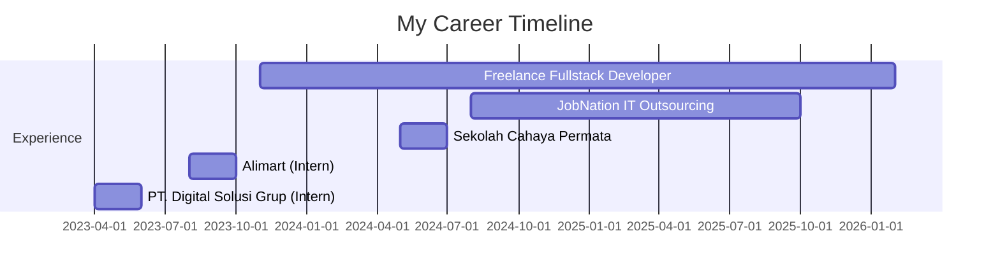

<div align="center">

```
██╗   ██╗ ██████╗ ██╗    ██╗  ██╗██████╗
██║   ██║██╔═══██╗██║    ╚██╗██╔╝██╔══██╗
██║   ██║██║   ██║██║     ╚███╔╝ ██║  ██║
██║   ██║██║▄▄ ██║██║     ██╔██╗ ██║  ██║
╚██████╔╝╚██████╔╝██║    ██╔╝ ██╗██████╔╝
 ╚═════╝  ╚══▀▀═╝ ╚═╝    ╚═╝  ╚═╝╚═════╝
```


# 👋 Hey there! I'm  **Uqi**

### 🚀 Fullstack Developer | 💜 Tech Enthusiast | 📍 Based in Malang, Indonesia

<p align="center">
  <em>"Transforming ideas into elegant code, one commit at a time"</em>
</p>

[](https://git.io/typing-svg)

<p align="center">
  <a href="https://www.linkedin.com/in/faruqi-rabbani/" target="_blank">
    
  </a>
  <a href="https://github.com/UQIXD" target="_blank">
    
  </a>
  <a href="mailto:faruqirabbani3@gmail.com">
    
  </a>
  <a href="https://www.instagram.com/faruqi_uqi/" target="_blank">
    
  </a>
</p>


</div>

## 🎯 About Me

```javascript
const uqi = {
  location: "Malang, Indonesia 🇮🇩",
  currentRole: "Fullstack Developer",
  code: ["JavaScript", "PHP", "HTML", "CSS", "SQL"],
  technologies: {
    frontEnd: {
      js: ["React", "Vite"],
      css: ["Tailwind CSS", "Bootstrap"],
      graphics: ["Three.js"],
    },
    backEnd: {
      php: ["Laravel", "CodeIgniter"],
      mobile: ["Ionic"],
    },
    databases: ["MySQL"],
    cms: ["WordPress"],
    versionControl: ["Git", "GitHub"],
  },
  currentlyLearning: "Advanced React Patterns & Performance Optimization",
  funFact: "I debug with console.log() and I'm not ashamed 😄",
};
```


## 🌟 Portfolio Highlights

<details open>
<summary><b>✨ Key Features</b></summary>
<br>

| Feature                  | Description                             | Status  |
| ------------------------ | --------------------------------------- | ------- |
| 🎨 **Dynamic Theming**   | Dark/Light mode with smooth transitions | ✅ Live |
| 🏎️ **3D Integration**    | Interactive Three.js car model          | ✅ Live |
| 🌐 **i18n Support**      | Bilingual (EN/ID) with persistence      | ✅ Live |
| 📱 **Responsive Design** | Mobile-first approach                   | ✅ Live |
| ⚡ **Smooth Animations** | AOS scroll animations                   | ✅ Live |
| 🎯 **Modern UI/UX**      | Clean and intuitive interface           | ✅ Live |

</details>


## 🛠️ Tech Stack

<div align="center">

### Frontend Arsenal 🎨

<p>
  
  
  
  
  
  
  
  
</p>

### Backend Power 💪

<p>
  
  
  
  
</p>

### Database & Tools 🗄️

<p>
  
  
  
  
</p>

</div>


## 💼 Professional Journey



<details>
<summary><b>📋 Expand for Details</b></summary>
<br>

### 🚀 **Freelance Fullstack Developer**

_Nov 2023 - Present_

- Building custom web applications for various clients
- Specializing in React, Laravel, and modern web technologies

### 💼 **Fullstack Developer @ JobNation IT Outsourcing**

_Aug 2024 - Oct 2025_

- Developed and maintained multiple client projects
- Collaborated with cross-functional teams

### 🎓 **Fullstack Developer @ Sekolah Cahaya Permata**

_May 2024 - Jul 2024_

- Created educational web applications
- Implemented responsive and user-friendly interfaces

### 📚 **Fullstack Developer (Intern) @ Alimart**

_Aug 2023 - Oct 2023_

- Assisted in e-commerce platform development
- Learned industry best practices

### 💻 **IT Staff (Intern) @ PT. Digital Solusi Grup**

_Apr 2023 - Jun 2023_

- Provided technical support
- Gained foundational IT experience

</details>


## 📊 GitHub Statistics

<div align="center">
  
  
  

</div>

<div align="center">
  
</div>

<div align="center">
  
</div>


## 🏆 GitHub Trophies

<div align="center">
  
</div>


## 📈 Contribution Graph

<div align="center">
  
</div>


## 🎮 Mini Game: Catch the Code!

<div align="center">

```
╔════════════════════════════════════════╗
║  🎯 CATCH THE BUG GAME 🐛             ║
║                                        ║
║  Rules:                                ║
║  1. Find and fix 3 bugs in the code   ║
║  2. First one to find wins! 🏆        ║
╚════════════════════════════════════════╝
```

<details>
<summary><b>🐛 Click to Play!</b></summary>

```javascript
// Can you spot the 3 bugs? 🔍

function calculateSum(arr) {
  let sum = 0;
  for (let i = 0; i <= arr.length; i++) {
    // Bug #1
    sum += arr[i];
  }
  return sum;
}

const greetUser = (name) => {
  console.log("Hello, " + nme); // Bug #2
};

class Developer {
  constructor(name) {
    this.name = name;
    this.skills = [];
  }

  addSkill(skill) {
    this.skills.push(skill);
    return this.skills; // Bug #3
  }
}

// Answers:
// Bug #1: i <= arr.length should be i < arr.length
// Bug #2: nme should be name
// Bug #3: Missing semicolon after return statement
```

**🎉 Found all bugs? You're awesome! Drop a ⭐ on this repo!**

</details>

</div>


## 📫 Let's Connect!

<div align="center">

```ascii
     _______________
    |  ___________  |
    | |           | |
    | | CONTACT   | |
    | |    ME     | |
    | |___     ___| |
    |_____|\_/|_____|
      _|__|/ \|_|_
     / ********** \
   /  ************  \
  --------------------
```

<p>
  <a href="https://www.linkedin.com/in/faruqi-rabbani/">
    
  </a>
  <a href="mailto:faruqirabbani3@gmail.com">
    
  </a>
  <a href="https://github.com/UQIXD">
    
  </a>
</p>

### 💬 Ask me about anything tech-related!

</div>


## ⚡ Fun Facts

<div align="center">

|  💻  |  🎯   |   ☕   |   🌟   |
| :--: | :---: | :----: | :----: |
| Code | Debug | Coffee | Repeat |

```javascript
while (alive) {
  eat();
  sleep();
  code();
  repeat();
}
```

> "Any fool can write code that a computer can understand. Good programmers write code that humans can understand."
> — Martin Fowler

</div>


## 📄 License

<div align="center">

This project is open source and available under the [MIT License](LICENSE).

### Show some ❤️ by starring ⭐ this repository!


</div>

---

<div align="center">
  
**© 2026 Muhammad Faruqi Rabbani**

Made with 💜 and ☕ in Malang, Indonesia


</div>
