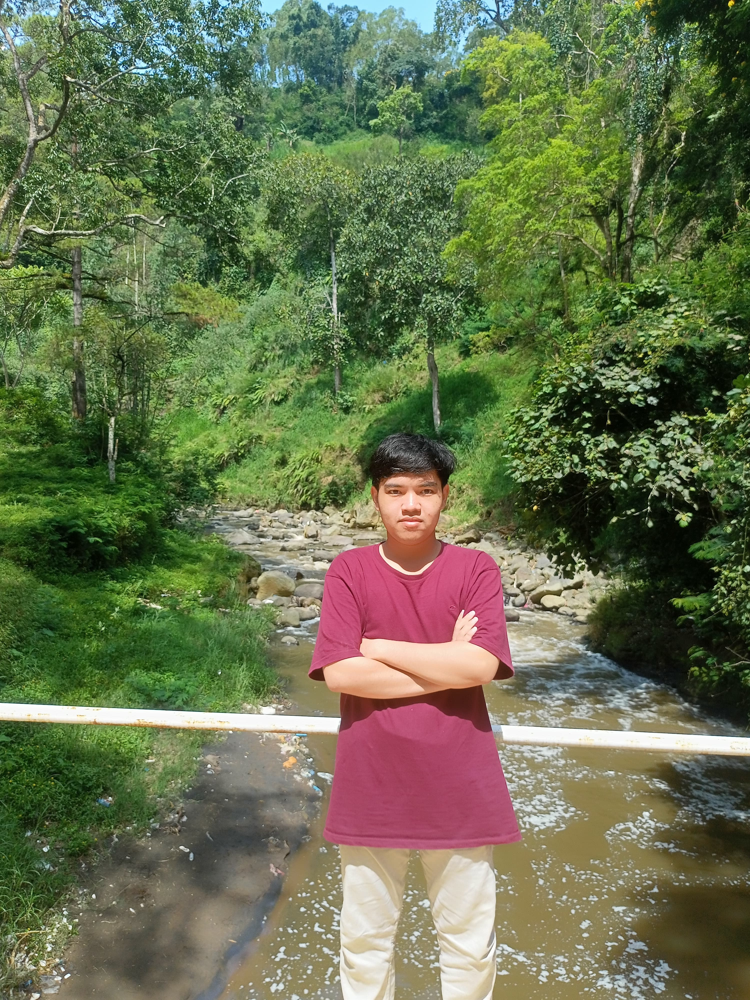

  

  <h1 style="font-size: 3rem; font-weight: bold; margin-top: 20px;">Hi, I'm Uqi! 👋</h1>
  
  <h3>Fullstack Developer 🚀 | Tech Enthusiast 💻 | Based in Malang</h3>

  

    <em>"Passionate about creating beautiful, functional, and user-friendly web applications using modern technologies."</em>
  

  

    
    
    
    
  

## 🌟 About This Portfolio

This repository contains the source code for my personal portfolio website. It is designed to be interactive, modern, and responsive.

### ✨ Key Features implemented:

- **🎨 Dynamic Theming:** Fully functional **Dark/Light Mode** toggle using Tailwind CSS and LocalStorage.
- **🏎️ 3D Integration:** Interactive 3D Car Model rendered using **Three.js** & GLTFLoader.
- **🌐 Localization:** Built-in **Dual Language Support (ID/EN)** that persists user preference.
- **📱 Responsive Design:** Mobile-first approach with a custom sidebar navigation for smaller screens.
- **⚡ Smooth Animations:** Elements animated on scroll using **AOS (Animate On Scroll)**.

---

## 🛠️ Tech Stack & Skills

### **Frontend**

### **Backend**

### **Database & Tools**

---

## 💼 Work Experience

- **Freelance Fullstack Developer** (Nov 2023 - Present)
- **Fullstack Developer** @ JobNation IT Outsourcing (Aug 2024 - Oct 2025)
- **Fullstack Developer** @ Sekolah Cahaya Permata (May 2024 - Jul 2024)
- **Fullstack Developer (Intern)** @ Alimart (Aug 2023 - Oct 2023)
- **IT Staff (Intern)** @ PT. Digital Solusi Grup (Apr 2023 - Jun 2023)

---

  
  

  
© 2026 Muhammad Faruqi Rabbani. Built with ❤️ and ☕.

